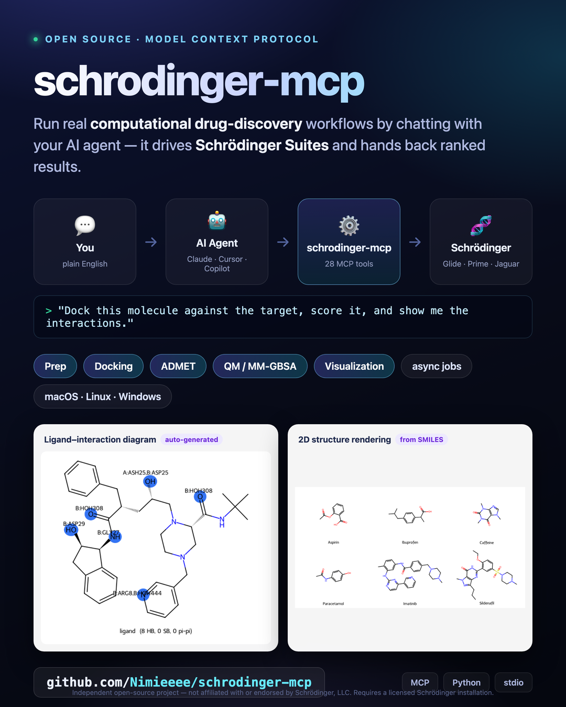

# schrodinger-mcp

<p align="center">
  
</p>

An [MCP](https://modelcontextprotocol.io) server that exposes **Schrödinger Suites**
computational-chemistry / drug-discovery workflows to **any MCP-capable coding agent** —
Claude Code, Claude Desktop, Cursor, GitHub Copilot, OpenCode, Cline, Windsurf, Zed, and
more. Ask your agent to fetch a PDB, prep a protein and ligands, build a Glide grid, dock,
score, run ADMET, MM-GBSA, QM, or draw a 2D interaction diagram — it drives Schrödinger for
you and hands back ranked tables plus files you can open in Maestro.

## How it works

The server runs in its **own virtualenv** (any Python ≥3.10) and shells out to
`$SCHRODINGER/run` for all chemistry. Its MCP dependencies therefore stay independent of
Schrödinger's bundled Python 3.11. Fast operations return inline; long jobs run under a
detached supervisor that survives server restarts, and you poll them with
`get_job_status` / `get_job_results`.

```
MCP client ──tool call──▶ schrodinger-mcp (venv, FastMCP, stdio)
                            │  fast ops ─▶ $SCHRODINGER/run python3 <worker>  ─▶ JSON
                            └  long jobs ─▶ detached supervisor ─▶ $SCHRODINGER/<launcher> -WAIT
                                             └─ status.json (authoritative) ◀─ poll
```

Outputs are written under `~/.local/share/schrodinger-mcp/` (override with
`SCHRODINGER_MCP_HOME`) and every tool also returns a structured summary.

## Requirements

- macOS, Linux, or Windows with **Schrödinger Suites** installed and licensed. Any
  recent release works — the server **auto-detects the newest installed version**
  (globbing `/opt/schrodinger/suites*` or `C:\Program Files\Schrodinger*`) and reports
  it via `detect_installation`. Set `SCHRODINGER` to pin a specific release.
- [`uv`](https://docs.astral.sh/uv/) (recommended) or `pip`.

> **Version support:** developed and validated against **Suites 2026-1**, but the server
> is version-agnostic — it discovers whatever release is installed and calls stable
> CLI/Python interfaces (with fallbacks for API calls that moved between releases). Tool
> flags target modern releases; on much older versions a flag may occasionally need a tweak.

> This project contains **no Schrödinger software or data**. You must supply your
> own licensed installation of Schrödinger Suites; this server only invokes it
> through its documented `$SCHRODINGER/run` / CLI interfaces.

> **GPU note:** Desmond molecular dynamics and FEP+ require an NVIDIA/CUDA GPU and are
> intentionally **not** exposed — they are not practical on Apple Silicon / non-NVIDIA hosts.

## Install

**macOS / Linux**

```bash
cd schrodinger-mcp
uv venv --python 3.12 .venv
source .venv/bin/activate
uv pip install -e ".[dev]"
```

**Windows** (PowerShell)

```powershell
cd schrodinger-mcp
uv venv --python 3.12 .venv
.venv\Scripts\activate
uv pip install -e ".[dev]"
```

The install root is auto-detected per platform (`/opt/schrodinger/suites*` on
macOS/Linux, `C:\Program Files\Schrodinger*` on Windows). Set `SCHRODINGER` to override.

Sanity check:

```bash
python -c "from schrodinger_mcp.tools.foundation import detect_installation as d; print(d()['version'])"
```

## Connect a coding agent

This is a standard **stdio** MCP server, so any MCP-capable client works. In every case
you point the client at the console script and set the `SCHRODINGER` env var. Use the
absolute path to the installed command:

| Platform | Server command (`<CMD>` below) |
|---|---|
| macOS / Linux | `/Users/mac/schrodinger mcp/.venv/bin/schrodinger-mcp` |
| Windows | `C:\path\to\schrodinger-mcp\.venv\Scripts\schrodinger-mcp.exe` |

And `<ROOT>` = your install root (`/opt/schrodinger/suites2026-1`, or
`C:\Program Files\Schrodinger2026-1`). After configuring, **restart the client**; the
`schrodinger` tools and the `schrodinger://installation` resource appear.

### Claude Code

```bash
claude mcp add schrodinger --env SCHRODINGER=<ROOT> -- "<CMD>"
```

### Cursor · Claude Desktop · Cline · Windsurf  (shared `mcpServers` format)

These four use the **same JSON shape** — just a different file:

| Client | Config file |
|---|---|
| Cursor | `~/.cursor/mcp.json` (global) or `.cursor/mcp.json` (per project) |
| Claude Desktop | `~/Library/Application Support/Claude/claude_desktop_config.json` (macOS) · `%APPDATA%\Claude\claude_desktop_config.json` (Windows) |
| Cline (VS Code) | the **“Configure MCP Servers”** panel → `cline_mcp_settings.json` |
| Windsurf | `~/.codeium/windsurf/mcp_config.json` |

```json
{
  "mcpServers": {
    "schrodinger": {
      "command": "<CMD>",
      "args": [],
      "env": { "SCHRODINGER": "<ROOT>" }
    }
  }
}
```

### GitHub Copilot (VS Code agent mode)

Create `.vscode/mcp.json` in the workspace (or run **“MCP: Add Server”** from the Command
Palette), then enable it in the Copilot Chat **Agent mode** tool picker:

```json
{
  "servers": {
    "schrodinger": {
      "type": "stdio",
      "command": "<CMD>",
      "args": [],
      "env": { "SCHRODINGER": "<ROOT>" }
    }
  }
}
```

### OpenCode

Add to `opencode.json` (project root) or `~/.config/opencode/opencode.json`:

```json
{
  "$schema": "https://opencode.ai/config.json",
  "mcp": {
    "schrodinger": {
      "type": "local",
      "command": ["<CMD>"],
      "environment": { "SCHRODINGER": "<ROOT>" },
      "enabled": true
    }
  }
}
```

### Zed

In `settings.json` (`context_servers`):

```json
{
  "context_servers": {
    "schrodinger": {
      "command": { "path": "<CMD>", "args": [], "env": { "SCHRODINGER": "<ROOT>" } },
      "settings": {}
    }
  }
}
```

### Any other MCP client

Transport **stdio**, command **`<CMD>`**, one environment variable **`SCHRODINGER=<ROOT>`**.
That's all the server needs. (On Windows use doubled backslashes inside JSON strings.)

> **Inline images:** the 2D-structure and interaction-diagram tools return MCP image
> content. Claude clients render it inline; other agents may show it as an attachment or
> just return the result — either way the PNG is always written to disk and its path is
> returned, so nothing is lost.

## Tools

**Foundation (synchronous)**

| Tool | What it does |
|---|---|
| `detect_installation` | Report root, version, installed workflows, hosts, GPU |
| `fetch_pdb` | Download a structure from RCSB by 4-char PDB ID |
| `convert_structure` | Convert between mae/maegz/sdf/pdb/mol2/smi/cif |
| `structure_info` | Counts, titles, charges, MW, chains, properties |
| `smiles_to_3d` | Quick single-conformer 3D from SMILES |
| `split_structures` / `merge_structures` | Split a multi-structure file / concatenate |

**Preparation (async)** — `ligprep`, `protein_prepwizard`, `epik`, `confgen`

**Glide docking** — `generate_glide_grid`, `glide_dock` (SP/XP), `summarize_docking` (sync)

**ADMET & site analysis** — `qikprop`, `compute_descriptors` (sync), `sitemap`, `shape_screen`

**QM & MM-GBSA** — `prime_mmgbsa`, `jaguar_qm`

**Visualization (sync)** — `render_2d_structure` (2D depiction PNG), `analyze_interactions`
(H-bonds / salt bridges / π-π / π-cation report), `ligand_interaction_diagram` (2D
interaction map PNG with residues labelled), `render_3d_view` (self-contained interactive
3D viewer HTML — rotate/zoom/share a protein-ligand pose with H-bonds drawn, no Maestro
needed), `generate_2d_report` (PDF/HTML of structures with properties)

**Async job control** — `get_job_status`, `get_job_results`, `cancel_job`, `list_jobs`

Async tools return a `job_id` immediately. Poll `get_job_status(job_id)` until
`state == "completed"`, then `get_job_results(job_id)` for the output files.

## Example: dock a ligand against a target

```
1. fetch_pdb("1HSG")                     → receptor.pdb
2. protein_prepwizard(receptor.pdb)      → job → prepared.maegz
3. ligprep("CC(=O)Oc1ccccc1C(=O)O")      → job → ligprep_out.maegz
4. generate_glide_grid(prepared, center=[x,y,z] or ligand_ref=...) → job → grid.zip
5. glide_dock(grid.zip, ligprep_out, precision="SP")  → job → dock_pv.maegz
6. summarize_docking(dock_pv.maegz)      → ranked GlideScore table
```

## Testing

```bash
pytest tests/test_unit.py -q            # fast unit tests, no Schrödinger needed
python tests/manual_docking_e2e.py      # real end-to-end docking (bundled fixture, ~3 min)
python tests/manual_wave5.py            # qikprop / MM-GBSA / sitemap / shape / jaguar
```

Inspect the live MCP server with the official inspector:

```bash
npx @modelcontextprotocol/inspector "/Users/mac/schrodinger mcp/.venv/bin/schrodinger-mcp"
```

## Configuration

| Env var | Default | Purpose |
|---|---|---|
| `SCHRODINGER` | autodetect | Install root |
| `SCHRODINGER_MCP_HOME` | `~/.local/share/schrodinger-mcp` | Job dirs, scratch, registry |
| `SCHRODINGER_MCP_MAX_JOBS` | `2` | Concurrent heavy-job advisory limit |
| `SCHRODINGER_MCP_SYNC_TIMEOUT` | `120` | Seconds before a sync op suggests going async |

## Disclaimer & trademarks

This is an **independent, unofficial** project. It includes no Schrödinger software,
source, or data, and requires a separately licensed Schrödinger Suites installation.

Schrödinger, Maestro, Glide, Desmond, Jaguar, Prime, QikProp, Epik, Phase, Canvas,
and SiteMap are trademarks of **Schrödinger, LLC**. This project is not affiliated
with, endorsed by, or sponsored by Schrödinger, LLC; product names are used only to
describe interoperability. Use of Schrödinger software is governed by your own license
agreement with Schrödinger — consult it before publishing benchmarks or results.

## License

[MIT](LICENSE) © 2026. Your use of the underlying Schrödinger Suites remains subject
to your Schrödinger license.
